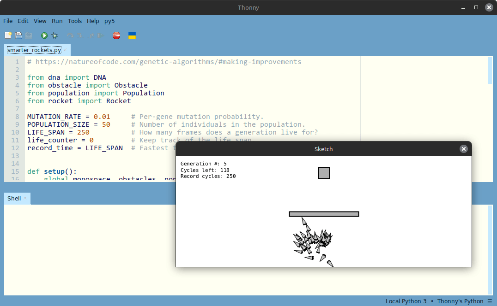

<h1>Nature of Code (2), py5 Port</h1>

*py5 implementations of Daniel Shiffman's "The Nature of Code" (2024 edition)*

**Built with [py5](https://py5coding.org) using [Thonny-py5mode](https://github.com/py5coding/thonny-py5mode)**

I've taken a few liberties in my interpretation. First, the examples in the book and its accompanying [p5.js sketches](https://natureofcode.com/examples) don't always align exactly. Second, in places, minor adjustments were necessary to support an idiomatic, py5-compatible Python implementation. Some chapters rely on p5.js-exclusive libraries, so I've had to employ substitutes/alternatives. Throughout, however, my goal has been to balance faithfulness to the original material with Python best practices and clarity for readers working through this [fantastic book](https://natureofcode.com).

To run the sketches, install [Thonny-py5mode](https://github.com/py5coding/thonny-py5mode) and activate **py5 → Imported mode for py5** in the editor.

Where text is displayed, the sketches use the *DejaVu Sans Mono* font.

---

**NOTE:** The `# PY5 IMPORTED MODE CODE` marker tells py5 to inject its API into the module's namespace, allowing external files to call py5 functions without explicitly importing py5. You'll see this marker in several modules, so that there's no need to add `from py5 import *` or `import py5`.

---

## ⚙️ Part 1: Inanimate Objects

  
Ch. 00 - Randomness

- **00.01 - traditional_random_walk** |
  py5: [ch00_randomness/00.01](ch00_randomness/00.01) |
  p5.js: [5C69XyrlsR](https://editor.p5js.org/natureofcode/sketches/5C69XyrlsR)

- **00.02 - random_number_distribution** |
  py5: [ch00_randomness/00.02](ch00_randomness/00.02) |
  p5.js: [u4vTwZuhT](https://editor.p5js.org/natureofcode/sketches/u4vTwZuhT)

- **00.03 - walker_tends_right** |
  py5: [ch00_randomness/00.03](ch00_randomness/00.03) |
  p5.js: [iAjs_70DF](https://editor.p5js.org/natureofcode/sketches/iAjs_70DF)

- **00.04 - gaussian_distribution** |
  py5: [ch00_randomness/00.04](ch00_randomness/00.04) |
  p5.js: [Yk_eSiNOR](https://editor.p5js.org/natureofcode/sketches/Yk_eSiNOR)

- **00.05 - accept_reject_distribution** |
  py5: [ch00_randomness/00.05](ch00_randomness/00.05) |
  p5.js: [3t5iHwA7Q](https://editor.p5js.org/natureofcode/sketches/3t5iHwA7Q)

- **00.06 - perlin_noise_walker** |
  py5: [ch00_randomness/00.06](ch00_randomness/00.06) |
  p5.js: [qyNwGUy59](https://editor.p5js.org/natureofcode/sketches/qyNwGUy59)

  
Ch. 01 - Vectors

- **01.01 - bouncing_ball_no_vectors** |
  py5: [ch01_vectors/01.01](ch01_vectors/01.01) |
  p5.js: [oadKdOndU](https://editor.p5js.org/natureofcode/sketches/oadKdOndU)

- **01.02 - bouncing_ball_vectors** |
  py5: [ch01_vectors/01.02](ch01_vectors/01.02) |
  p5.js: [qU5oPJijX](https://editor.p5js.org/natureofcode/sketches/qU5oPJijX)

- **01.03 - vector_subtraction** |
  py5: [ch01_vectors/01.03](ch01_vectors/01.03) |
  p5.js: [HtXiElQbC](https://editor.p5js.org/natureofcode/sketches/HtXiElQbC)

- **01.04 - vector_multiplication** |
  py5: [ch01_vectors/01.04](ch01_vectors/01.04) |
  p5.js: [VQfwqpDlv](https://editor.p5js.org/natureofcode/sketches/VQfwqpDlv)

- **01.05 - vector_magnitude** |
  py5: [ch01_vectors/01.05](ch01_vectors/01.05) |
  p5.js: [rld_CtioUU](https://editor.p5js.org/natureofcode/sketches/rld_CtioUU)

- **01.06 - vector_normalization** |
  py5: [ch01_vectors/01.06](ch01_vectors/01.06) |
  p5.js: [5dWkegAID](https://editor.p5js.org/natureofcode/sketches/5dWkegAID)

- **01.07 - motion_101_velocity** |
  py5: [ch01_vectors/01.07](ch01_vectors/01.07) |
  p5.js: [6foX0NUfS](https://editor.p5js.org/natureofcode/sketches/6foX0NUfS)

- **01.08 - motion_101_velocity_constant_accel** |
  py5: [ch01_vectors/01.08](ch01_vectors/01.08) |
  p5.js: [4GSialOpQw](https://editor.p5js.org/natureofcode/sketches/4GSialOpQw)

- **01.09 - motion_101_velocity_random_accel** |
  py5: [ch01_vectors/01.09](ch01_vectors/01.09) |
  p5.js: [w9DU8ccWMf](https://editor.p5js.org/natureofcode/sketches/w9DU8ccWMf)

- **01.10 - motion_101_accel_toward_mouse** |
  py5: [ch01_vectors/01.10](ch01_vectors/01.10) |
  p5.js: [gYJHm1EFL](https://editor.p5js.org/natureofcode/sketches/gYJHm1EFL)

  
Ch. 02 - Forces

- **02.01 - forces** |
  py5: [ch02_forces/02.01](ch02_forces/02.01) |
  p5.js: [4IRI8BEVE](https://editor.p5js.org/natureofcode/sketches/4IRI8BEVE)

- **02.02 - forces_two_objects** |
  py5: [ch02_forces/02.02](ch02_forces/02.02) |
  p5.js: [ePLfo-OGu](https://editor.p5js.org/natureofcode/sketches/ePLfo-OGu)

- **02.03 - gravity_scaled_mass** |
  py5: [ch02_forces/02.03](ch02_forces/02.03) |
  p5.js: [0RiwMFOQ7](https://editor.p5js.org/natureofcode/sketches/0RiwMFOQ7)

- **02.04 - including_friction** |
  py5: [ch02_forces/02.04](ch02_forces/02.04) |
  p5.js: [I4wC4aXd-E](https://editor.p5js.org/natureofcode/sketches/I4wC4aXd-E)

- **02.05 - fluid_resistance** |
  py5: [ch02_forces/02.05](ch02_forces/02.05) |
  p5.js: [FknzcAaVh](https://editor.p5js.org/natureofcode/sketches/FknzcAaVh)

- **02.06 - attraction** |
  py5: [ch02_forces/02.06](ch02_forces/02.06) |
  p5.js: [Cl0Eeaz_V](https://editor.p5js.org/natureofcode/sketches/Cl0Eeaz_V)

- **02.07 - attraction_many_movers** |
  py5: [ch02_forces/02.07](ch02_forces/02.07) |
  p5.js: [LSXJ6-VziJ](https://editor.p5js.org/natureofcode/sketches/LSXJ6-VziJ)

- **02.08 - two_body_attraction** |
  py5: [ch02_forces/02.08](ch02_forces/02.08) |
  p5.js: [cmj37xPCM](https://editor.p5js.org/natureofcode/sketches/cmj37xPCM)

- **02.09 - n_bodies** |
  py5: [ch02_forces/02.09](ch02_forces/02.09) |
  p5.js: [uT9VpVvCO](https://editor.p5js.org/natureofcode/sketches/uT9VpVvCO)  

  
Ch. 03 - Oscillation

- **03.01 - angular_motion_rotate** |
  py5: [ch03_oscillation/03.01](ch03_oscillation/03.01) |
  p5.js: [EFCfyH88E](https://editor.p5js.org/natureofcode/sketches/EFCfyH88E)

- **03.02 - forces_arbitrary_angular_motion** |
  py5: [ch03_oscillation/03.02](ch03_oscillation/03.02) |
  p5.js: [xj2C2Ldbo](https://editor.p5js.org/natureofcode/sketches/xj2C2Ldbo)

- **03.03 - pointing_direction_motion** |
  py5: [ch03_oscillation/03.03](ch03_oscillation/03.03) |
  p5.js: [bZqHGYbRQ](https://editor.p5js.org/natureofcode/sketches/bZqHGYbRQ)

- **03.04 - polar_to_cartesian** |
  py5: [ch03_oscillation/03.04](ch03_oscillation/03.04) |
  p5.js: [qcnlfvP3q](https://editor.p5js.org/natureofcode/sketches/qcnlfvP3q)

- **03.05 - simple_harmonic_motion_i** |
  py5: [ch03_oscillation/03.05](ch03_oscillation/03.05) |
  p5.js: [O8LMHH-Df](https://editor.p5js.org/natureofcode/sketches/O8LMHH-Df)

- **03.06 - simple_harmonic_motion_ii** |
  py5: [ch03_oscillation/03.06](ch03_oscillation/03.06) |
  p5.js: [gwdC8X-W-j](https://editor.p5js.org/natureofcode/sketches/gwdC8X-W-j)

- **03.07 - oscillator_objects** |
  py5: [ch03_oscillation/03.07](ch03_oscillation/03.07) |
  p5.js: [b3HpgJa6F](https://editor.p5js.org/natureofcode/sketches/b3HpgJa6F)

- **03.08 - static_wave** |
  py5: [ch03_oscillation/03.08](ch03_oscillation/03.08) |
  p5.js: [CQ19Yw0iT](https://editor.p5js.org/natureofcode/sketches/CQ19Yw0iT)

- **03.09 - the_wave** |
  py5: [ch03_oscillation/03.09](ch03_oscillation/03.09) |
  p5.js: [qe6oK9F1o](https://editor.p5js.org/natureofcode/sketches/qe6oK9F1o)

- **03.10 - spring_connection** |
  py5: [ch03_oscillation/03.10](ch03_oscillation/03.10) |
  p5.js: [HZOUeCe9p](https://editor.p5js.org/natureofcode/sketches/HZOUeCe9p)

- **03.11 - swinging_pendulum** |
  py5: [ch03_oscillation/03.11](ch03_oscillation/03.11) |
  p5.js: [MQZWruTlD](https://editor.p5js.org/natureofcode/sketches/MQZWruTlD)

  
Ch. 04 - Particle Systems

- **04.01 - single_particle** |
  py5: [ch04_particle_systems/04.01](ch04_particle_systems/04.01) |
  p5.js: [1gpoE1dtG](https://editor.p5js.org/natureofcode/sketches/1gpoE1dtG)

- **04.02 - array_of_particles** |
  py5: [ch04_particle_systems/04.02](ch04_particle_systems/04.02) |
  p5.js: [-xTbGZMim](https://editor.p5js.org/natureofcode/sketches/-xTbGZMim)

- **04.03 - particle_emitter** |
  py5: [ch04_particle_systems/04.03](ch04_particle_systems/04.03) |
  p5.js: [WkX_YtT7xN](https://editor.p5js.org/natureofcode/sketches/WkX_YtT7xN)

- **04.04 - system_of_emitters** |
  py5: [ch04_particle_systems/04.04](ch04_particle_systems/04.04) |
  p5.js: [s_Y3-Mmo7](https://editor.p5js.org/natureofcode/sketches/s_Y3-Mmo7)

- **04.05 - system_inheritance_polymorphism** |
  py5: [ch04_particle_systems/04.05](ch04_particle_systems/04.05) |
  p5.js: [2ZlNJp2EW](https://editor.p5js.org/natureofcode/sketches/2ZlNJp2EW)

- **04.06 - particle_system_forces** |
  py5: [ch04_particle_systems/04.06](ch04_particle_systems/04.06) |
  p5.js: [uZ9CfjLHL](https://editor.p5js.org/natureofcode/sketches/uZ9CfjLHL)

- **04.07 - particle_system_repeller** |
  py5: [ch04_particle_systems/04.07](ch04_particle_systems/04.07) |
  p5.js: [H4TMayNak](https://editor.p5js.org/natureofcode/sketches/H4TMayNak)

- **04.08 - image_texture_system** |
  py5: [ch04_particle_systems/04.08](ch04_particle_systems/04.08) |
  p5.js: [9c_CPrg3Bp](https://editor.p5js.org/natureofcode/sketches/9c_CPrg3Bp)

- **04.09 - additive_smoke_system** |
  py5: [ch04_particle_systems/04.09](ch04_particle_systems/04.09) |
  p5.js: [fUCtCcOtB](https://editor.p5js.org/natureofcode/sketches/fUCtCcOtB)

---

## 🧬 Part 2: It's Alive!

  
Ch. 05 - Autonomous Agents

- **05.01 - seeking_target** |
  py5: [ch05_autonomous_agents/05.01](ch05_autonomous_agents/05.01) |
  p5.js: [Y74O77yxy](https://editor.p5js.org/natureofcode/sketches/Y74O77yxy)

- **05.02 - arriving_at_target** |
  py5: [ch05_autonomous_agents/05.02](ch05_autonomous_agents/05.02) |
  p5.js: [v-yJm8WUx](https://editor.p5js.org/natureofcode/sketches/v-yJm8WUx)

- **05.03 - stay_within_walls** |
  py5: [ch05_autonomous_agents/05.03](ch05_autonomous_agents/05.03) |
  p5.js: [fGNwVP3h7](https://editor.p5js.org/natureofcode/sketches/fGNwVP3h7)

- **05.04 - flow_field_follow** |
  py5: [ch05_autonomous_agents/05.04](ch05_autonomous_agents/05.04) |
  p5.js: [egribz8WV](https://editor.p5js.org/natureofcode/sketches/egribz8WV)

- **05.05 - simple_path_only** |
  py5: [ch05_autonomous_agents/05.05](ch05_autonomous_agents/05.05) |
  p5.js: [8SALyBTym](https://editor.p5js.org/natureofcode/sketches/8SALyBTym)

- **05.06 - simple_path_follow** |
  py5: [ch05_autonomous_agents/05.06](ch05_autonomous_agents/05.06) |
  p5.js: [zcH21K3T3](https://editor.p5js.org/natureofcode/sketches/zcH21K3T3)

- **05.07 - multiple_segments_only** |
  py5: [ch05_autonomous_agents/05.07](ch05_autonomous_agents/05.07) |
  p5.js: [ntGaosFQ7](https://editor.p5js.org/natureofcode/sketches/ntGaosFQ7)

- **05.08 - multiple_segments_follow** |
  py5: [ch05_autonomous_agents/05.08](ch05_autonomous_agents/05.08) |
  p5.js: [1T-6LupvJ](https://editor.p5js.org/natureofcode/sketches/1T-6LupvJ)

- **05.09 - separation** |
  py5: [ch05_autonomous_agents/05.09](ch05_autonomous_agents/05.09) |
  p5.js: [S7YOOYs7T](https://editor.p5js.org/natureofcode/sketches/S7YOOYs7T)

- **05.10 - separation_and_seek** |
  py5: [ch05_autonomous_agents/05.10](ch05_autonomous_agents/05.10) |
  p5.js: [UJEwENSN3](https://editor.p5js.org/natureofcode/sketches/UJEwENSN3)

- **05.11 - flocking** |
  py5: [ch05_autonomous_agents/05.11](ch05_autonomous_agents/05.11) |
  p5.js: [IkpBw96Sd](https://editor.p5js.org/natureofcode/sketches/IkpBw96Sd)

- **05.12 - flocking_bin_lattice** |
  py5: [ch05_autonomous_agents/05.12](ch05_autonomous_agents/05.12) |
  p5.js: [QXONgLiJ0](https://editor.p5js.org/natureofcode/sketches/QXONgLiJ0)

- **05.13 - quadtree** |
  py5: [ch05_autonomous_agents/05.13](ch05_autonomous_agents/05.13) |
  p5.js: [J5XVww9xQ](https://editor.p5js.org/natureofcode/sketches/J5XVww9xQ)

- **05.14 - cosine_lookup** |
  py5: [ch05_autonomous_agents/05.14](ch05_autonomous_agents/05.14) |
  p5.js: [uqRJyVq8g](https://editor.p5js.org/natureofcode/sketches/uqRJyVq8g)

  
Ch. 06 - Physics Libraries

- **Proofs of concept:** [pymunk_poc](ch06_physics_libraries/pymunk_poc.py) | 
  [toxiclibs_poc](ch06_physics_libraries/toxiclibs_poc.py)

- 🚧 COMING SOON ...  
  *Substitute: Matter.js --> https://www.pymunk.org*  
  *Substitute: Toxiclibs.js --> https://github.com/postspectacular/toxiclibs* (Java)  

  
Ch. 07 - Cellular Automata

- **07.01 - wolfram_elementary** |
  py5: [ch07_cellular_automata/07.01](ch07_cellular_automata/07.01) |
  p5.js: [SaLy-OnPZ](https://editor.p5js.org/natureofcode/sketches/SaLy-OnPZ)

- **07.02 - game_of_life** |
  py5: [ch07_cellular_automata/07.02](ch07_cellular_automata/07.02) |
  p5.js: [vzLjFYwJc](https://editor.p5js.org/natureofcode/sketches/vzLjFYwJc)

- 07.03 - 🚧 IN PROGRESS ... |
  py5: [ch07_cellular_automata/07.03](ch07_cellular_automata/07.03) |
  p5.js: [13KF3ysx8](https://editor.p5js.org/natureofcode/sketches/13KF3ysx8)

  
Ch. 08 - Fractals

- **08.01 - recursive_circles_once** |
  py5: [ch08_fractals/08.01](ch08_fractals/08.01) |
  p5.js: [yqMKM_1NS](https://editor.p5js.org/natureofcode/sketches/yqMKM_1NS)

- 🚧 IN PROGRESS ...  
  *Should be a near 1:1 JS-to-py5 conversion (no extra libs or major API differences),  
  so rest of chapter shouldn't take me long.*

---

## 🧠 Part 3: Intelligence

  
Ch. 09 - Evolutionary Computing

- **09.01 - ga_shakespeare** |
  py5: [ch09_evolutionary_computing/09.01](ch09_evolutionary_computing/09.01) |
  p5.js: [q4F192JCV](https://editor.p5js.org/natureofcode/sketches/q4F192JCV)

- **09.02 - smart_rockets** |
  py5: [ch09_evolutionary_computing/09.02](ch09_evolutionary_computing/09.02) |
  p5.js: [jzfy_9p1ES](https://editor.p5js.org/natureofcode/sketches/jzfy_9p1ES)

- **09.03 - smarter_rockets** |
  py5: [ch09_evolutionary_computing/09.03](ch09_evolutionary_computing/09.03) |
  p5.js: [565K_KXSA](https://editor.p5js.org/natureofcode/sketches/565K_KXSA)

- **09.04 - interactive_selection** |
  py5: [ch09_evolutionary_computing/09.04](ch09_evolutionary_computing/09.04) |
  p5.js: [dUeAaapkQ](https://editor.p5js.org/natureofcode/sketches/dUeAaapkQ)

- **09.05 - evolving_ecosystem** |
  py5: [ch09_evolutionary_computing/09.05](ch09_evolutionary_computing/09.05) |
  p5.js: [1HDlp_tKF](https://editor.p5js.org/natureofcode/sketches/1HDlp_tKF)

  
Ch. 10 - Neural Networks

- **10.01 - the_perceptron** |
  py5: [ch10_neural_networks/10.01](ch10_neural_networks/10.01) |
  p5.js: [sMozIaMCW](https://editor.p5js.org/natureofcode/sketches/sMozIaMCW)

- **10.02 - gesture_classifier** |
  py5: [ch10_neural_networks/10.02](ch10_neural_networks/10.02) |
  p5.js: [SbfSv_GhM](https://editor.p5js.org/natureofcode/sketches/SbfSv_GhM)

  
Ch. 11 - Neuroevolution

- **11.01 - flappy_bird** |
  py5: [ch11_neuroevolution/11.01](ch11_neuroevolution/11.01) |
  p5.js: [Pv-JlO0cl](https://editor.p5js.org/natureofcode/sketches/Pv-JlO0cl)

- **11.02 - flappy_bird_neuroevolution** |
  py5: [ch11_neuroevolution/11.02](ch11_neuroevolution/11.02) |
  p5.js: [PEUKc5dpZ](https://editor.p5js.org/natureofcode/sketches/PEUKc5dpZ)

- **11.03 - smart_rockets_neuroevolution** |
  py5: [ch11_neuroevolution/11.03](ch11_neuroevolution/11.03) |
  p5.js: [KkV4lTS4H](https://editor.p5js.org/natureofcode/sketches/KkV4lTS4H)

- **11.04 - neuroevolutionary_steering** |
  py5: [ch11_neuroevolution/11.04](ch11_neuroevolution/11.04) |
  p5.js: [fZDfxxVrf](https://editor.p5js.org/natureofcode/sketches/fZDfxxVrf)

- **11.05 - sensor_bloop** |
  py5: [ch11_neuroevolution/11.05](ch11_neuroevolution/11.05) |
  p5.js: [vCTMtXXSS](https://editor.p5js.org/natureofcode/sketches/vCTMtXXSS)

- **11.06 - neuroevolutionary_ecosystem** |
  py5: [ch11_neuroevolution/11.06](ch11_neuroevolution/11.06) |
  p5.js: [IQbcREjUK](https://editor.p5js.org/natureofcode/sketches/IQbcREjUK)

---

⬆️ [top](#top)

<!--

Approx. page counts for each chapter, ranked largest to smallest:

06_libraries.html   -- ~82 pages
05_steering.html    -- ~78 pages
09_ga.html          -- ~72 pages
10_nn.html          -- ~56 pages
03_oscillation.html -- ~53 pages
02_forces.html      -- ~53 pages
04_particles.html   -- ~46 pages
11_nn_ga.html       -- ~45 pages
07_ca.html          -- ~43 pages
01_vectors.html     -- ~42 pages
08_fractals.html    -- ~41 pages
00_randomness.html  -- ~38 pages

-->
